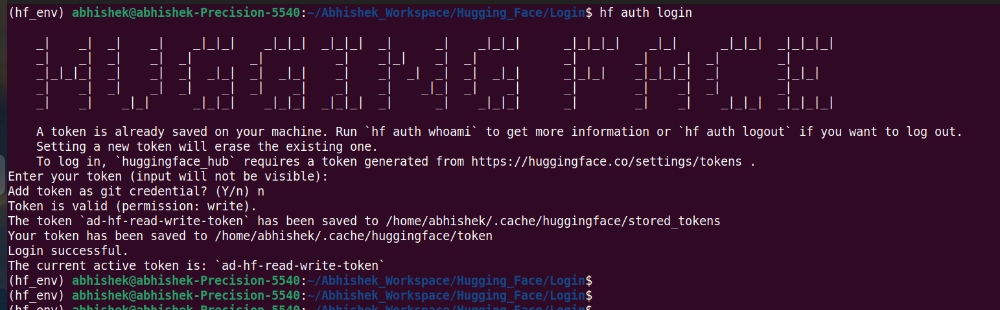
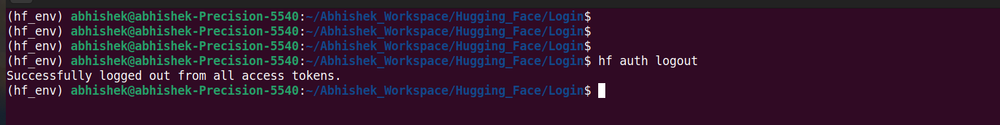

## Hugging Face Login

**Author: Abhishek Dey**


### Create a dot env file and keep the hf-token

```

touch .env

copy hugging face token in .env file

```

```
HF_TOKEN_WRITE="hf_**************************"

```

### CLI Login

```
hf auth login

```

<p align="left">

</p>


### Check the logged-in username

```
hf auth whoami

```

<p align="left">

</p>


### CLI Logout

```

hf auth logout

```

<p align="left">

</p>


### API Login

* Checkout [hf_api_login](hf_api_login.ipynb)

