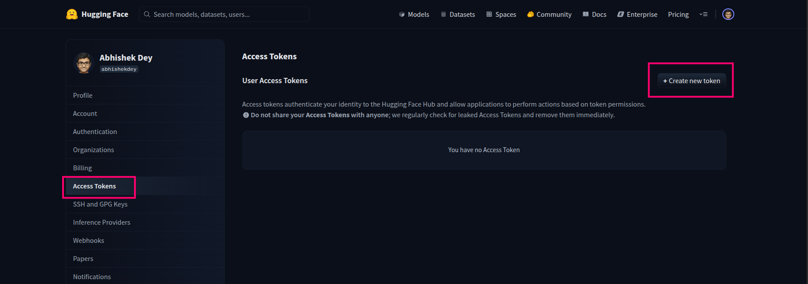
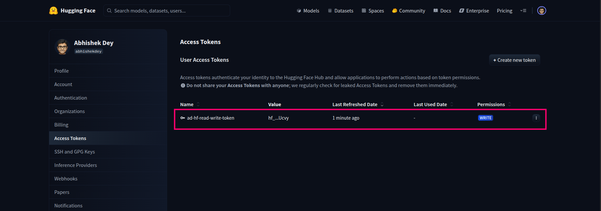

## This repo contain tutorials related to Hugging Face

**Author: Abhishek Dey**


### Create Access Token

* Create an account in [Hugging Face](https://huggingface.co/)

* Go to **Settings** -> **Access Tokens**

* Click on **Create new token**

<p align="left">

</p>


* Create a token in **write** model and save the token in a text file

<p align="left">

</p>


### Create environment

```

conda create -n hf_env python=3.10

conda activate hf_env

python -m pip install --upgrade pip

pip install --upgrade huggingface_hub transformers sentence-transformers bitsandbytes torch

pip install -r requirements.txt


```
